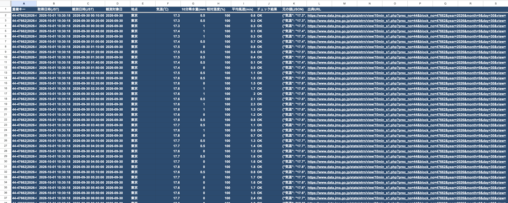
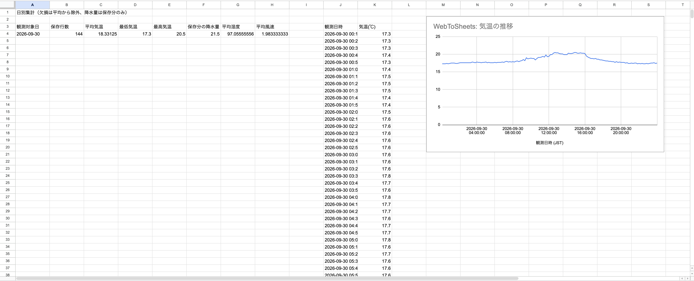

# WebToSheets — 公開気象データ収集ポートフォリオ

Pythonで**公開HTMLをスクレイピング → 整形 → 重複・異常チェック → Google Sheetsへ時系列で追記 → 定期実行とログ → 集計・グラフ**を行う小規模ツールです。

題材は気象庁「過去の気象データ検索」の東京・10分値。JSONの気象APIを呼ぶ方式ではなく、`requests`でHTMLを取得し、`BeautifulSoup`で表を抽出します。認証が必要なのは書込先のGoogle Sheetsだけです。

**このページで閲覧できる10分値は昨日までです（制作時に確認）。当日のリアルタイム収集は行いません。** 約10分周期は取得処理の実行周期であり、元データの公開周期を示すものではありません。今日のページに公開前の案内がある場合はスキップし、昨日の公開済みデータを保存します。

## フォルダ構成

```text
WebToSheets-portfolio-v2/
├── README.md
├── requirements.txt
├── .gitignore
├── musicbrainz_api/       # これまでのAPI学習用（別プロジェクト）
│   ├── main.py
│   └── README.md
└── weather_scraping/     # 今回の気象スクレイピング版
    ├── main.py           # 実行・定期実行・ログ
    ├── weather.py        # HTTP取得・HTML解析・値の検査・重複除去
    ├── sheets.py         # OAuth認証・追記・集計・グラフ設定
    ├── config.example.json
    └── tests/               # 抽出とSheets送信内容のテスト
```

実行時に `config.json`、`token.json`、`logs/weather.log` が作られます。認証ファイル、実際の設定、仮想環境、Git履歴、ログは配布ZIPに含めていません。

## 実装した内容

|工程|実装|
|---|---|
|取得|東京の10分値HTML、HTTPタイムアウト、HTTPエラー判定|
|抽出|取得日時・観測日時・観測対象日・地点・気温・10分降水量・湿度・平均風速|
|整形|数値への変換、JST統一、24:00を翌日00:00へ正規化|
|重複|地点コード＋観測日時のキー。Sheetsの既存キーを毎回読む|
|検査|欠損、品質記号、形式異常、簡単な範囲検査、列構造検査|
|蓄積|新規行のみRAWで追加。観測日時順に並べ替え|
|認証|OAuth、token.json再利用、期限切れトークン更新|
|定期実行|`--loop` で約600秒周期。失敗時も次周期で継続|
|ログ|成功件数・重複件数・異常・エラー。1MB×最大4ファイルにローテーション|
|集計|Google SheetsのQUERYで日別集計|
|グラフ|Google Sheets上に観測日時と気温の折れ線グラフを作成|

## Macで最初に動かす

Python 3.10以上を想定。既存のWebToSheetsを上書きせず、このZIPを別フォルダに展開してください。既存の `.venv` をZIPに入れたりコピーしたりする必要はありません。

ターミナルで展開先に移動し、以下を順に実行します（場所に合わせて `cd` を変更）。

```bash
cd ~/Desktop/WebToSheets-portfolio-v2
python3 -m venv .venv
source .venv/bin/activate
python -m pip install --upgrade pip
python -m pip install --only-binary=cryptography -r requirements.txt
cd weather_scraping
cp config.example.json config.json
```

既存の仮想環境を使う場合も、この `requirements.txt` をインストールしてください。VS Codeの実行ボタンで別のPythonが選ばれる場合は、`(.venv)` の付いたターミナルから実行します。

### 1. Googleを使わずに取得を試す

```bash
python main.py --dry-run
```

昨日と今日のページを確認し、公開済み分の抽出件数と最後の3行を表示します。今日のページが公開前ならINFOログでスキップします。日時列はこの確認表示ではSheets用の数値です。Sheetsへ保存すると日時の表示形式になります。

指定した日の確認もできます。

```bash
python main.py --dry-run --date 2026-09-30
```

### 2. 書込先を用意

新しい空のGoogleスプレッドシートを作成してください。MusicBrainz学習用とは別にします。

URLが `https://docs.google.com/spreadsheets/d/XXXXXXXX/edit` の場合、`XXXXXXXX` の部分を `config.json` の `spreadsheet_id` に設定します。

```json
{
  "spreadsheet_id": "ここに新しいスプレッドシートID",
  "station": {"name": "東京", "prec_no": "44", "block_no": "47662"},
  "interval_seconds": 600
}
```

この簡易版は東京専用です。他地点は項目数や表の種類が違う場合があるため、コードによる構造確認と変更が必要です。

### 3. 認証と集計・グラフの初期設定

これまで使っていたGoogle CloudプロジェクトでGoogle Sheets APIを有効にし、デスクトップアプリ用のOAuthクライアントJSONを取得します。既存の `credentials.json` を使う場合は、**Mac上で自分で** `weather_scraping/credentials.json` にコピーしてください。このZIPに認証情報は入っていません。

```bash
python main.py --setup
```

ブラウザで書込先を編集できるGoogleアカウントを選び、認証します。このフォルダ用の `token.json` が保存されます。既存トークンをコピーする必要はありません。

`Weather` と `Summary` が作成され、日時の表示形式・集計式・グラフが設定されます。このツール専用のシート名です。SummaryのA:HとJ:Kは数式展開用に空けておいてください。`--setup` は集計式を再設定し、自分が作ったグラフを置き換えます。

### 4. 1回保存、重複チェック

```bash
python main.py
python main.py
```

2回目に新しい観測がなければ `新規追加=0` になります。初回は確認したページの公表済みデータ（通常は昨日分）をまとめて追加します。以降は未登録分だけ追加します。

### 5. 約10分間隔で実行

```bash
python main.py --loop
```

ターミナルを開いたままにします。停止は `Control+C`。処理時間を含めて約600秒周期です。Macがスリープ中・電源OFF・ターミナルを閉じた状態では収集できません。復帰後は昨日と今日のデータを補いますが、それより前の未収集日は自動補完しません。

長く停止していた日の補完は手動で行えます（1日ずつ、連続大量アクセスをしない）。

```bash
python main.py --date 2026-09-30
```

この版では常駐サービスの自動登録は行いません。10分周期のコードを用意し、初心者がターミナルから開始・停止できる構成にしています。

## Google Sheetsで見る内容

`Weather` に12列を保存します。取得日時はその行を初めて保存した実行の日時です。重複行の取得日時は更新しません。

|列|内容|
|---|---|
|A|地点コード＋観測日時の重複キー|
|B|取得日時(JST)|
|C|観測日時(JST)|
|D|観測対象日（元ページの日付）|
|E|地点|
|F|気温(℃)|
|G|直前10分の降水量(mm)|
|H|相対湿度(%)|
|I|平均風速(m/s)|
|J|OKまたは欠損・形式異常などの理由|
|K|元の4項目の文字列(JSON)|
|L|気象庁の取得元ページURL|

`Summary` に日別の保存行数、平均/最低/最高気温、保存分の降水量合計、平均湿度、平均風速を表示します。J:Kの観測日時順データを使い、気温の時系列グラフを自動作成します。

**集計は収集済みデータに対する集計です。** 当日途中や欠損のある日は完全な日平均・日降水量ではありません。欠損は平均から除外し、降水量は数値として保存できた分だけ合計します。保存行数は項目ごとの有効件数ではありません。24:00の観測日時は翌日ですが、日別集計は元の観測対象日に含めます。

## 欠損・異常の扱い

- 空欄、`×`、`///`、`#` はこのツールでは欠損・利用不可として空欄にし、ゼロへ変換しません。
- 気象庁の `--` は「該当現象なし」です。降水量に限り0.0へ整形し、元の記号もJSONに残します。数値の0.0も降水量では0.5mm未満を表すため、合計は表示値の合計です。
- `)` や `]` を含む数値は品質記号付きとして空欄にし、元値と理由を残します。
- 数字に変換できない値、設定した範囲外の値も空欄にします。
- 4項目すべてが欠損・異常なら行自体を保留し、次周期で再確認します。
- 未到来の観測時刻の行は保存しません。
- 表の見出し・列数が変われば停止し、誤った列の保存を防ぎます。

範囲検査は明らかな異常を見つけるための簡易検査で、気象学的な品質保証ではありません。公表後に訂正された値や、一部欠損を保存した後に補完された値は、今回の「新規のみ追加」方式では更新しません。

## エラー・ログ

`weather_scraping/logs/weather.log` に記録します。HTTP失敗や認証失敗時はその周期を中止します。ループでは次の周期で再試行し、単発実行では終了コード1を返します。ページ間は1秒以上離し、HTTPの即時連続リトライは行いません。

追記が成功したのに応答だけが途切れた場合も、次回Sheetsからキーを読み直します。**同じスプレッドシートへの収集プロセスは1つだけ**動かしてください。同時実行の排他制御は今回の簡易版に含めていません。

- `config.json` がない → 設定例をコピー。
- 認証が必要 → `python main.py --setup`。
- `RefreshError` → 自分のMacで気象版の `token.json` を削除して再度 `--setup`（認証情報は送付しない）。
- HTTPエラー → 接続・対象日を確認し、時間を置いて再実行。
- 表の構造エラー → 対象ページを目視し、`weather.py` の列定義とテストを修正。
- 集計の `#REF!` → SummaryのA:H/J:Kに数式の展開を妨げる入力がないか確認。

OAuthアプリを外部・テストモードで利用している場合、トークンの再認証が必要になることがあります。最初は手動実行と短期間のループで確認してください。

## テスト

リポジトリの先頭で実行します。Google認証・ネット接続は不要です。

```bash
python -m unittest discover -s weather_scraping/tests -v
```

欠損/形式/範囲、品質記号、24:00、未到来行、列構造変更、重複・順序、HTTPエラーとタイムアウト、Sheetsへの送信内容、行数拡張、グラフ置換を検証します。HTMLテスト値は架空です。

制作時には東京・2026-09-30の実HTMLで144行の抽出を確認し、2026-10-01の実ページが「昨日まで公開」と案内される場合も処理を継続できることを確認しています。個人のOAuthを使ったGoogle Sheetsへの実書込は実施していません。利用者の環境で `--setup` → 単発実行2回 → Summaryの確認が最終確認です。

## GitHub公開前の確認

新しいフォルダを新しいリポジトリとして公開してください。添付元の `.git` 履歴は引き継いでいません。

```bash
git init
git add .
git status --short
git diff --cached --name-only
```

認証ファイル・token・config.json・.venv・logsが表示されないことを確認してからコミットします。`.gitignore` は既にコミットされた秘密情報を消す機能ではありません。個人の設定ファイルや認証情報をREADME・画像・実行ログへ貼らないでください。

公開説明例：

> 気象庁の公開HTMLをrequests/BeautifulSoupで取得し、欠損・形式異常の検査と観測日時による重複除去を行った上でGoogle Sheetsへ蓄積するPythonツール。OAuth認証、約10分周期の実行、ログ、日別集計と時系列グラフに対応。

## 出典・利用上の位置づけ

出典：気象庁「過去の気象データ検索」。本ツールは取得値を抽出・加工して表示します。気象庁が作成したツールではありません。

- [東京の10分値（例：2026-09-30）](https://www.data.jma.go.jp/stats/etrn/view/10min_s1.php?prec_no=44&block_no=47662&year=2026&month=9&day=30&view=)
- [気象庁：値欄の記号の説明](https://www.data.jma.go.jp/stats/data/mdrr/man/remark.html)
- [気象庁ホームページの利用規約](https://www.jma.go.jp/jma/kishou/info/coment.html)
- [Google Sheets API](https://developers.google.com/workspace/sheets/api)

データの出典URLは各行にも残します。取得対象は1地点・2ページで、10分以上の周期を守る設計です。防災判断や予報ではなく、データ連携を学び、実装を説明するためのポートフォリオです。HTMLの変更・公表の遅延・Google Sheetsの容量制限などに合わせて保守が必要です。

## 動作画面

### 取得データ（Weather）

気象庁の公開ページから取得した気象データをGoogle Sheetsへ蓄積します。



### 日別集計・時系列グラフ（Summary）

保存したデータから日別集計と気温の時系列グラフを作成します。

